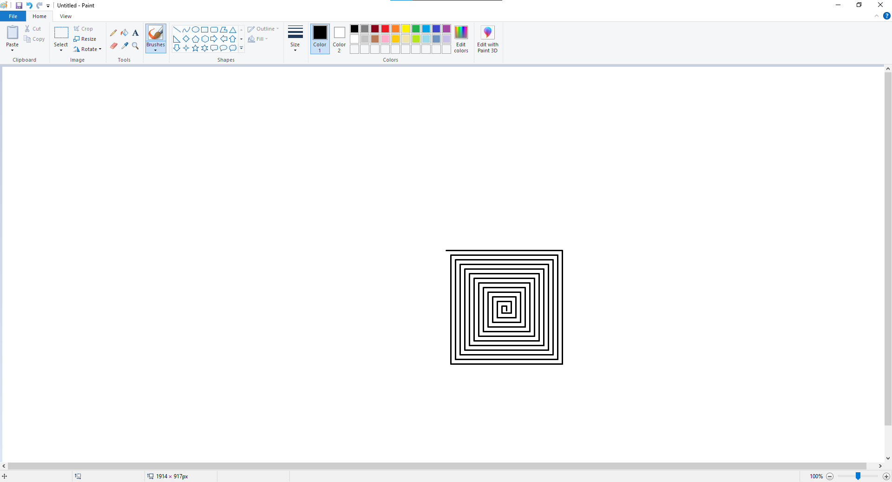

#  PyAutoGUI Paint Auto Draw

This project uses [PyAutoGUI](https://pyautogui.readthedocs.io/en/latest/) to automate the opening of **MS Paint** and draw a spiral at the center of the screen.  
It’s a simple but powerful example of how Python can control the keyboard and mouse for desktop automation.

---

## 📌 Table of Contents
- [Overview](#-overview)
- [How it Works](#-how-it-works)
- [Requirements](#-requirements)
- [Installation](#-installation)
- [Usage](#-usage)
- [Code Explanation](#-code-explanation)
- [Author](#-author)

---

## 🖌️ Overview
This script demonstrates how you can use **automation** to:
- Launch Windows applications from Python.
- Control windows and the mouse pointer.
- Automatically draw shapes (in this case, a spiral).

It’s a practical example of *“Automate the Boring Stuff with Python”* applied to desktop graphics.

---

## ⚙️ How it Works
1. The script launches `mspaint.exe`.
2. Waits a short time for the Paint window to appear.
3. Maximizes the Paint window using the shortcut `Alt + Space → X`.
4. Moves the cursor to the center of the screen and clicks to select the drawing area.
5. Draws a **spiral** using controlled mouse drag movements (`dragRel`).

---

## 📦 Requirements
- Python 3.7+
- Python libraries:
  - `pyautogui`

---

## 🔧 Installation
Clone the repository:
```bash
git clone https://github.com/username/pyautogui-paint-spiral.git
cd pyautogui-paint-spiral
  
  
  🔧 Install dependencies:
```bash
pip install pyautogui

  ⚠️ Important:

PyAutoGUI will automatically move your cursor.

To stop the script immediately, move your cursor quickly to the top-left corner of the screen (PyAutoGUI’s FAILSAFE feature).


    
    
    
    📜 Code Explanation

subprocess.Popen(["mspaint"]) → launches MS Paint.

pyautogui.hotkey("alt","space"); pyautogui.press("x") → maximizes the active window.

pyautogui.size() → gets the screen dimensions.

pyautogui.click(center_x, center_y) → positions the cursor in the middle of the screen.

The while distance > 0 loop → draws the spiral step by step (right, down, left, up) with decreasing distance.


